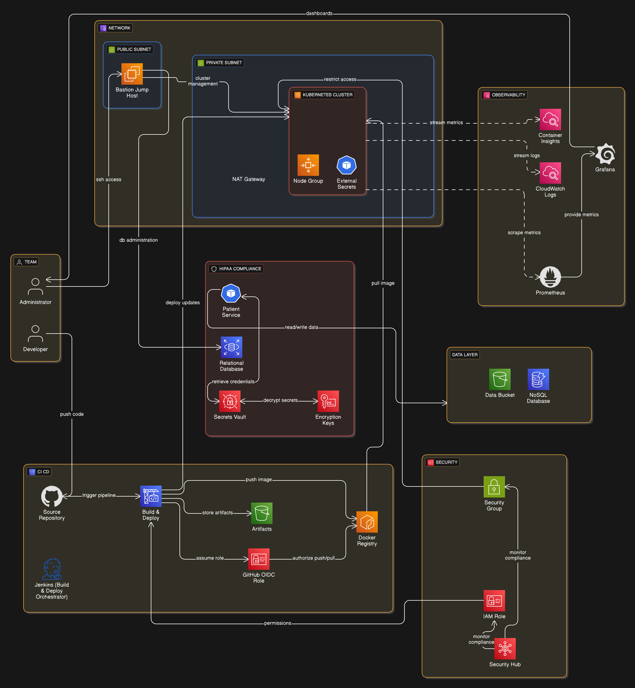

🏥 HIPAA-Aligned DevSecOps Platform on AWS EKS

A production-grade, security-first DevSecOps platform built on AWS using Terraform, Kubernetes (EKS), GitHub Actions, Jenkins, and cloud-native security patterns.

This project mirrors how regulated environments (healthcare / finance / enterprise) actually design, deploy, and operate cloud platforms — prioritizing security, auditability, least privilege, and reproducibility over shortcuts.

🚀 Project Overview

This repository contains a full DevSecOps platform, not a demo or tutorial stack.

It demonstrates how to:

Build private-by-default AWS infrastructure

Run secure Kubernetes workloads on EKS

Separate CI and CD responsibilities

Enforce DevSecOps security gates

Manage secrets without storing them in Git

Design for observability, incident response, and disaster recovery

Operate in a HIPAA-aligned, audit-friendly manner

⚠️ No real PHI is processed.
This project demonstrates HIPAA-aligned architectural controls without making compliance claims.

🧱 Architecture Summary

Core design principles

🔐 Private-by-default networking

🧠 Least-privilege IAM everywhere

📜 Everything auditable

♻️ Fully reproducible via Infrastructure-as-Code

🧪 Security enforced before deployment

High-level flow

## 🧱 Platform Architecture (AWS)

The diagram below illustrates the end-to-end DevSecOps platform, including
network segmentation, private EKS access, CI/CD flow, secrets management,
observability, and the HIPAA-aligned data layer.

🧩 Phased Build (Real-World Order)

This platform was built incrementally, the same way real teams do it — validating security and operability at every step.

✅ Phase 0 — Local Prerequisites

Local tooling verified before any cloud changes (Terraform, kubectl, Helm, Trivy, etc.) 

✅ Phase 1 — Secure Terraform Bootstrap

Remote Terraform state in S3

State locking via DynamoDB

KMS encryption enabled

No local state files

🔍 Why this matters: prevents drift, supports recovery, enables audits

✅ Phase 2–4 — Networking + EKS (Private-by-Default)

VPC with public, private, and isolated subnets

No public EKS API endpoint

Managed node groups in private subnets

Control plane audit logs enabled

IRSA (OIDC) enabled from day one

🧠 kubectl access is only possible from inside the VPC (via bastion + SSM).
This is intentional and mirrors real HIPAA / enterprise clusters.

✅ Phase 3.3–3.5 — Observability & Alerting

Prometheus + Grafana (Helm-managed)

CloudWatch dashboards for EKS SRE signals

Alertmanager → Slack (CRD-based, not Helm churn)

Observability was staged intentionally to reduce blast radius and allow controlled rollout. 

✅ Phase 5 — Secure Data Layer

RDS (encrypted, private, backups, deletion protection)

DynamoDB (KMS + PITR)

S3 (KMS, versioning, lifecycle rules)

Access pattern:

❌ No credentials in Git

❌ No credentials in pods

✅ IAM Roles for Service Accounts (IRSA)

✅ Secrets Manager + KMS

✅ Phase 8 — Secrets Management (HIPAA-Aware)

AWS Secrets Manager as system of record

External Secrets Operator (ESO)

IRSA-based authentication

Kubernetes Secrets treated as ephemeral cache

Rotation-ready by design

🔐 Apps never talk to AWS.
They only read Kubernetes Secrets injected securely at runtime.

✅ Phase 9 — CI/CD Split (Senior-Level Pattern)
Capability	GitHub Actions (CI)	Jenkins (CD)
Terraform fmt/validate	✅	❌
IaC scanning	✅	❌
Image build & scan	✅	❌
Deploy to EKS	❌	✅
Environment promotion	❌	✅
Approvals & audit	❌	✅

🧠 This separation prevents Jenkins from becoming a security liability and aligns with regulated change-management workflows.

✅ Phase 10 — Secure Microservice Deployment

A safe demo service (patient-service) proving:

ALB ingress

Autoscaling (HPA)

Namespace isolation (dev/stage/prod)

Hardened containers (non-root, read-only FS)

Artifact-based deployment

No PHI. Fake data only.

✅ Phase 11 — DevSecOps Security Gates

Terraform scanning (Checkov, tfsec)

Container scanning (Trivy)

Kubernetes manifest validation

GitHub OIDC → AWS (no static credentials)

Unsafe changes never reach production.

✅ Phase 12 — Disaster Recovery Design

In-region HA (multi-AZ)

Backup + restore procedures

IaC rebuild strategy

Optional “pilot-light” multi-region design

Documented in:
📄 docs/dr-runbook.md

🔍 Real Troubleshooting (What This Project Proves)

This repo intentionally documents real failures and fixes, including:

Private EKS API access issues (expected, secure behavior)

IRSA misconfiguration and trust-policy debugging

Fluent Bit + CloudWatch IAM edge cases

Helm implicit defaults causing hidden outputs

DynamoDB encryption idempotency traps

Runtime package installs failing in private subnets

These are real production issues that senior engineers solve — not lab exercises.

🧠 Key Design Decisions (Why This Looks “Enterprise”)

Private EKS API → reduced attack surface

IRSA everywhere → zero static credentials

Artifact-based delivery → auditability & immutability

CI/CD separation → controlled promotions

Security gates first-class → shift-left security

Rebuild + restore DR → reliable recovery strategy

This platform was designed to be defensible under review, not just functional.

🏁 Final Status

✔ Production-grade AWS infrastructure
✔ Secure EKS platform
✔ CI + CD separation
✔ DevSecOps security gates
✔ Artifact-based delivery
✔ Observability & alerting
✔ Disaster recovery design

This is a full DevSecOps platform — not a demo.